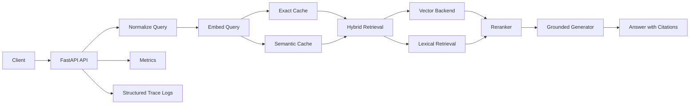

# Real-Time Multimodal RAG System

[](https://www.python.org/)
[](https://fastapi.tiangolo.com/)
[](#pinecone-setup)
[](#redis-semantic-cache)
[](#ci-automation)

Production-oriented multimodal Retrieval-Augmented Generation system built to demonstrate applied AI engineering, not just model experimentation. The project now includes both a FastAPI retrieval service and a Streamlit demo dashboard backed by a self-healing model bundle for recruiter-friendly demonstrations.

## Why This Project Matters

This repository is designed to show the skills employers look for in Applied AI, ML Systems, and LLM Infrastructure roles:

- retrieval system design rather than prompt-only LLM usage
- latency-aware serving with exact and semantic cache layers
- observable APIs with metrics, structured traces, and benchmark evidence
- deployment readiness through Docker, Kubernetes, and CI validation
- portfolio-quality documentation that explains tradeoffs and system behavior clearly

## System Targets

- Throughput path toward 1000+ QPS with shared cache and horizontal scaling
- p95 latency target under 200 ms for fast-path requests
- grounded answers with citations and reproducible evaluation thresholds
- benchmark artifacts and automated validation suitable for GitHub presentation

## What Is Implemented

- FastAPI service with a multimodal query contract
- pluggable vector backend: in-memory, FAISS-ready, or Pinecone
- hybrid retrieval: dense search plus lexical blending
- optional reranking with CrossEncoder fallback strategy
- Redis exact cache and distributed semantic cache via Redis Stack
- structured JSON request tracing and metrics endpoints
- k6 load testing and Markdown benchmark report generation
- GitHub Actions workflow for validation, container build, and optional benchmark smoke test
- deterministic demo training pipeline and persisted model bundle for dashboard use
- Streamlit dashboard with five tabs and live churn-risk inference

## Architecture At A Glance



Full architecture and system positioning:

- [docs/architecture.md](docs/architecture.md)
- [docs/system-card.md](docs/system-card.md)
- [docs/portfolio-summary.md](docs/portfolio-summary.md)

## Quickstart

1. Create and activate a virtual environment.

```powershell
python -m venv .venv
.\.venv\Scripts\Activate.ps1
pip install -r requirements.txt
```

2. Copy environment settings.

```powershell
Copy-Item .env.example .env
```

3. Build the local sample index.

```powershell
python scripts/build_index.py --input data/raw/sample_docs.jsonl --output data/processed/index.json
```

4. Build or refresh the demo bundle.

```powershell
python train_demo.py
```

5. Start the Streamlit dashboard.

```powershell
streamlit run streamlit_app.py
```

6. Start the API.

```powershell
uvicorn app.main:app --reload --host 0.0.0.0 --port 8000
```

7. Send a test API request.

```powershell
curl -X POST "http://localhost:8000/v1/query" ^
  -H "Content-Type: application/json" ^
  -d "{\"mode\":\"text\",\"text\":\"How does retrieval reduce hallucinations?\",\"top_k\":5,\"use_hybrid\":true}"
```

## API Example

`POST /v1/query`

Request:

```json
{
  "mode": "text",
  "text": "What is RAG?",
  "top_k": 5,
  "use_hybrid": true,
  "hybrid_alpha": 0.7,
  "use_rerank": false,
  "rerank_top_n": 10,
  "max_context_chunks": 6,
  "fast_mode": true
}
```

Response:

```json
{
  "answer": "...",
  "citations": [
    {
      "doc_id": "doc-1",
      "score": 0.83,
      "snippet": "RAG grounds model responses..."
    }
  ],
  "latency_ms": 104.2,
  "mode": "text",
  "trace_id": "..."
}
```

Response headers:

- `X-Trace-Id`
- `X-Cache-Status`

## Streamlit Dashboard

Launch locally:

```powershell
streamlit run streamlit_app.py
```

Tabs included:

- Overview
- Model Results
- Analytics
- Pipeline/API
- Predict

Dashboard behavior:

- loads `models/demo_bundle.pkl` once via `st.cache_resource`
- automatically rebuilds the bundle from `train_demo.py` if the file is missing or corrupt
- uses the persisted full dataset and aggregates from the bundle rather than re-importing training data at runtime
- provides live inference with probability distribution, confidence, risk band, and input summary

Current demo bundle summary:

- best model: Logistic Regression
- demo ROC-AUC: 0.7685
- persisted artifact: `models/demo_bundle.pkl`

## Training And Bundle

Training entrypoint:

```powershell
python train_demo.py
```

What it does:

- generates deterministic synthetic customer churn data safely
- trains three classification models
- evaluates and selects the best model
- writes `models/demo_bundle.pkl` with models, analytics data, feature schema, metrics, and examples for the dashboard

## Performance And Evidence

### Evaluation

Run threshold validation against retrieval and quality targets:

```powershell
python scripts/run_eval.py --predictions eval/sample_predictions.json --thresholds eval/thresholds.yaml
```

### Load Testing

Basic k6 run:

```powershell
k6 run benchmarks/k6_query.js
```

Reproducible benchmark with report output:

```powershell
python scripts/run_benchmark.py --base-url http://localhost:8000 --rate 100 --duration 1m
```

This generates a timestamped folder under `benchmark_runs/` with:

- `metrics_before.json`
- `metrics_after.json`
- `k6_summary.json`
- `report.md`

These artifacts are meant to support portfolio claims with raw evidence rather than screenshots alone.

Example committed benchmark evidence:

- [benchmark_runs/local-proof-run/report.md](benchmark_runs/local-proof-run/report.md)

## Observability

Metrics endpoints:

```text
GET /metrics
GET /metrics/prometheus
```

Available signals:

- total request count and per-mode counts
- exact cache hit count
- semantic cache hit count
- cache miss count
- rolling app latency summary: average, p50, p95, p99

Tracing and logs:

- one structured JSON log line per request
- stage timings for normalize, embed, cache, retrieve, rerank, generate, and cache write
- cache status, backend selection, retrieved-doc count, and citation count

## Deployment

### Docker

```powershell
docker compose up --build
```

This starts:

- FastAPI on `http://localhost:8000`
- Streamlit on `http://localhost:8501`
- Redis Stack on `http://localhost:6379`

### Kubernetes

```powershell
kubectl apply -f kubernetes/deployment.yaml
kubectl apply -f kubernetes/hpa.yaml
```

### Ray Serve

Ray Serve entrypoint is available in [app/serve/ray_app.py](app/serve/ray_app.py) for future scale-out experiments.

## CI Automation

Workflow file: [/.github/workflows/ci.yml](.github/workflows/ci.yml)

The workflow provides:

- validation job for dependency install, local index build, evaluation threshold check, and tests
- Docker build validation job
- optional benchmark smoke test on manual dispatch with artifact upload

Manual benchmark workflow run:

1. Open the `ci` workflow in GitHub Actions.
2. Choose `Run workflow`.
3. Enable `run_benchmark`.

## Repository Standards

Public-facing repository conventions are included:

- [CONTRIBUTING.md](CONTRIBUTING.md)
- [docs/release-checklist.md](docs/release-checklist.md)
- [.github/pull_request_template.md](.github/pull_request_template.md)
- [.github/ISSUE_TEMPLATE/bug_report.md](.github/ISSUE_TEMPLATE/bug_report.md)
- [.github/ISSUE_TEMPLATE/feature_request.md](.github/ISSUE_TEMPLATE/feature_request.md)
- [LICENSE](LICENSE)

CODEOWNERS is configured for [Muhammad-Farooq13](https://github.com/Muhammad-Farooq13).

## Redis Semantic Cache

Relevant `.env` settings:

```env
CACHE_ENABLED=true
CACHE_BACKEND=redis
REDIS_URL=redis://localhost:6379/0
CACHE_TTL_SECONDS=300
SEMANTIC_CACHE_THRESHOLD=0.92
SEMANTIC_CACHE_MAX_ENTRIES=5000
SEMANTIC_CACHE_DISTRIBUTED=true
REDIS_VECTOR_INDEX_NAME=idx:rag:semantic
REDIS_VECTOR_PREFIX=rag:semantic:
REDIS_VECTOR_SEARCH_K=5
```

Behavior:

- exact cache reuses identical requests across replicas
- distributed semantic cache reuses near-duplicate requests via RediSearch vector lookup
- local fallback preserves semantic reuse if RediSearch is unavailable
- service continues operating if Redis is unavailable, with degraded cache capability

The provided `docker-compose.yml` uses Redis Stack so vector index commands are available locally.

## Pinecone Setup

To switch to Pinecone:

```env
VECTOR_BACKEND=pinecone
PINECONE_API_KEY=your_key_here
PINECONE_INDEX_NAME=multimodal-rag-index
PINECONE_NAMESPACE=default
PINECONE_CLOUD=aws
PINECONE_REGION=us-east-1
```

Bulk sync the local corpus:

```powershell
python scripts/sync_pinecone.py --input data/processed/index.json --batch-size 100 --retries 3
```

If Pinecone credentials are missing or initialization fails, the service falls back safely to in-memory retrieval.

## Hybrid Retrieval And Reranking

- `use_hybrid=true` blends dense and lexical retrieval
- `hybrid_alpha=1.0` means dense-only ranking
- `hybrid_alpha=0.0` means lexical-only ranking
- `use_rerank=true` enables a reranking pass over candidates
- reranker uses CrossEncoder when available and falls back to embedding similarity otherwise

## FAISS Notes

- set `VECTOR_BACKEND=faiss` to use FAISS mode
- install FAISS separately if your platform requires a manual wheel
- if FAISS is not available at runtime, the service falls back to in-memory retrieval

## Skills Demonstrated

- Retrieval-Augmented Generation design
- multimodal API design
- vector search backend abstraction
- deterministic ML training and artifact packaging
- Streamlit dashboard delivery for stakeholder demos
- hybrid retrieval and reranking
- distributed caching
- latency instrumentation and structured tracing
- benchmark automation and performance reporting
- containerization and CI automation

## Maintainer

- Name: Muhammad Farooq
- Email: mfarooqshafee333@gmail.com
- GitHub: [Muhammad-Farooq13](https://github.com/Muhammad-Farooq13)

## Suggested Next Enhancements

- wire full Whisper ASR and vision embedding models into the online path
- add metadata filtering and tenant-aware access control
- integrate RAGAS for richer answer quality evaluation
- add model and prompt versioning for experiment tracking
- publish one clean benchmark report and CI badge snapshot for GitHub presentation
