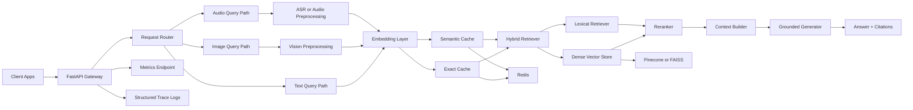

# System Architecture

This document describes the production-oriented architecture for the Real-Time Multimodal RAG System.

## High-Level Goals

- Support text, image, and audio queries
- Ground answers with retrieved evidence
- Reduce hallucinations with hybrid retrieval, reranking, and citation-aware generation
- Scale toward 1k+ QPS with cache-aware and horizontally scalable components

## Architecture Diagram

## Request Lifecycle

1. The API accepts text, image, or audio requests.
2. The request is normalized into query text or a modality-specific representation.
3. The system checks exact cache and semantic cache before retrieval.
4. On cache miss, dense retrieval runs against the vector backend.
5. Optional lexical retrieval is blended into a hybrid result set.
6. Optional reranking improves relevance ordering.
7. A grounded answer is generated from the selected context chunks.
8. Metrics, tracing data, and cache status are emitted for observability.

## Production Components

- API layer: FastAPI
- Vector search: Pinecone, FAISS, or in-memory fallback
- Cache layer: Redis exact cache plus distributed semantic cache via Redis Stack
- Retrieval: dense plus lexical fusion
- Reranking: CrossEncoder with embedding fallback
- Benchmarking: k6 plus benchmark report generator
- Deployment: Docker, Kubernetes, optional Ray Serve

## Scaling Strategy

- Horizontal API replicas behind a load balancer
- Shared Redis cache for cross-replica exact and semantic cache reuse
- Managed vector backend for large-scale retrieval workloads
- Autoscaling based on latency, CPU, request concurrency, and queue depth
- Benchmark evidence captured through k6 and app metrics endpoints

## Failure and Fallback Design

- If Pinecone is unavailable, fallback uses in-memory retrieval for local development continuity.
- If RediSearch vector commands are unavailable, semantic cache falls back to in-process similarity matching.
- If optional reranking models are unavailable, embedding-based rerank fallback keeps the path live.
- If external credentials are missing, the project still runs locally with reduced capability but preserved API behavior.
